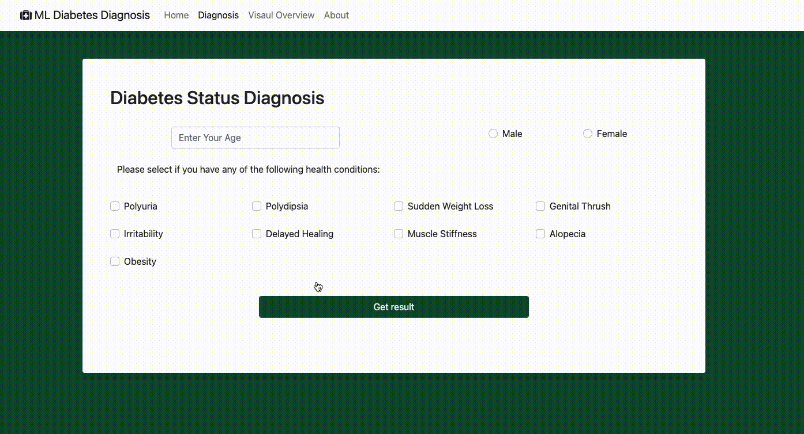

# Leveraging Cloud Pak for Data to Utilize Machine Learning for Diabetes Prediction and Build an Interactive Web Application

>View the Live Application [Here](https://diabetes.sokratic.app/)

In this project, we showcase how IBM Cloud Pak for Data can be utilized to leverage machine learning techniques for predicting a patient's diabetes status. The primary focus is on developing a robust machine learning model with IBM Watson Machine Learning (WML) as the base for model deployment. With the power of Cloud Pak for Data, we demonstrate the seamless integration of Python programming, Jupyter Notebooks, scikit-learn, Pandas, Flask, and Plotly Dash to create an interactive web application.

By utilizing Cloud Pak for Data, you'll see how machine learning models can be constructed, trained, and deployed with ease. We highlight the importance of feature selection, data preprocessing, and hyperparameter tuning in achieving accurate diabetes predictions. With Cloud Pak for Data's support, Jupyter Notebooks provide an interactive and collaborative environment for developing and refining machine learning models.

To deliver the trained machine learning model to end-users, we deploy it within a web-based application using Flask, a lightweight and versatile web framework. The integration of Plotly Dash enhances the visualization capabilities of the web application, allowing users to have an interactive and visually appealing experience.

With Cloud Pak for Data, you'll gain proficiency in essential tools and frameworks used in the machine learning community. You'll be able to leverage the power of IBM Watson Machine Learning, Python programming, scikit-learn, Pandas, Flask, and Plotly Dash to develop and deploy machine learning applications effectively.

This project serves as a demonstration, showcasing how IBM Cloud Pak for Data enables seamless integration of machine learning models into web applications, offering a scalable and efficient solution for deploying machine learning applications. By utilizing Cloud Pak for Data, you can unlock the full potential of machine learning and create impactful applications for solving real-world problems.

### Technology Stack

> The following technologies were utilized:

| Technology                                                   | Description                                                                                                          |
| ------------------------------------------------------------ | -------------------------------------------------------------------------------------------------------------------- |
|                    | The Modern Data Platform by IBM                                                                                      |
|                      | Cloud Pak for Data's Model Deployment Spaces                                                                         |
|                                                            | The primary programming language for developing the machine learning models and web application                     |
|                                  | Used for interactive and collaborative development during the creation of machine learning models with WML           |
|                                        | A powerful library used for building and training the machine learning models                                         |
|                                                            | Utilized for data manipulation, preprocessing, and feature engineering to prepare the dataset for model training     |
|                                                                | A lightweight and versatile web framework used for developing the web application to deploy the machine learning models |
|                                                | Integrated into the Flask app to generate interactive and visually appealing data visualizations                      |
|                                                            | Leveraged for asynchronous functions to optimize user experience and ensure smooth interactions in the web application |
|                                            | Adopted for achieving a responsive and aesthetically pleasing design, making the web application accessible across devices |

## Learning Outcomes
Through the demonstration of deploying machine learning applications with IBM Cloud Pak for Data and WML, users will gain insights into the following areas:

**Machine Learning Model Development**: Understanding the construction, training, feature selection, data preprocessing, and hyperparameter tuning of machine learning models using IBM Cloud Pak for Data and Jupyter Notebooks.

**Tool Proficiency**: Becoming proficient in Anaconda, Jupyter Notebooks, Scikit-learn, Pandas, and Seaborn, which are widely used tools in the machine learning community.

**Web Application Development with Flask:** Learning about web frameworks, routing, and handling user requests by building a web application with Flask to efficiently serve machine learning model predictions to end-users.

**Integration of Plotly Dash**: Exploring the seamless integration of Plotly Dash into a Flask application to create dynamic and insightful visualizations for users.

**Asynchronous Functions with jQuery and AJAX**: Incorporating jQuery and AJAX in the web application to improve responsiveness and user experience, allowing for real-time interactions.

Overall, this demo provides a comprehensive understanding of machine learning model development, web application deployment, and the importance of interactive data visualizations for end-users. These skills establish a solid foundation for future endeavors in the fields of data science and web development with IBM Cloud Pak for Data and WML.

## Future Improvements To-Do List

- [ ] Move all of the Notebooks and prelimenary work into Cloud Pak for Data - Git Integrated Repository
- [ ] Enhance model accuracy by exploring AutoAI
- [ ] Leverage Watson OpenScale to Monitor Model
- [ ] Introduce Model Fact Sheets section
- [ ] Optimize the web application's responsiveness and performance for better user experience.
- [ ] Move the application to IBM Cloud
- [ ] Refactor and clean the codebase for better readability and maintainability.
- [ ] Implement error handling and validation for user inputs.
- [ ] Provide detailed documentation and a step-by-step walkthrough/lab guide for future users.
